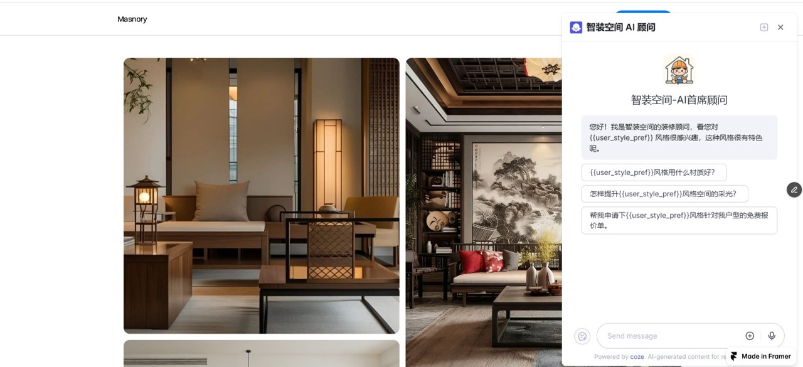

# 🚀 Boosting Customer Conversion via Image-Preference AI Chatbots

**"Converting browsers to buyers: An AI-driven chatbot that gains real-time preference insights from image interactions to provide targeted help."**

---

## 💡 The Problem (Why we built this?)
Most websites lose customers because of **boring forms**. People hate typing their phone numbers or house sizes. They just want to see beautiful designs, but traditional sites force them to stop and fill out data.

*Figure: Traditional Static Forms vs. Our AI-Driven Interaction*

---

## ✨ Our Solution (The "Wow" Strategy)
We use **AI-Driven insights** to catch customer preferences without asking a single question.

* **Browse**: A **customer** looks at an **image** of a "Modern Style" living room.
* **Recognize**: The system "sees" the click and identifies their **preference** instantly.
* **Chat**: The **chatbot** pops up with **targeted help**: *"I see you love Modern Style! Want to see a 3D plan for your home?"*

---

## 🎥 Demo (Watch AI in action)
> **User Flow**: User clicks a style → AI instantly recognizes the preference → Chatbot offers targeted help.

---

## 🛠️ How it Works (Lightweight & Fast)
We used a **Lightweight No-Code/Low-Code stack** to build this professional tool:

### 1. The Brain (Coze AI)
We created an AI Agent that can "remember" variables.
* **Variable**: `user_style_pref` (Stores what the customer likes).
* **Logic**: The AI changes its greeting and recommendation logic based on this variable.

> **Figure 1**: Our AI strategy for recognizing user preferences via backend variables.

### 2. The Website (Framer)
A fast, high-end landing page. Every image has a "hidden listener" that tells the AI exactly what the customer is looking at in real-time.

### 3. The Integration (JS SDK)
We used a simple JavaScript SDK script to connect the website and the AI. It passes data in real-time to **boost purchase intent** without refreshing the page.

---

## 📈 Business Value
* **Higher Conversion**: No more friction. Customers start talking to AI naturally because the AI already "knows" them.
* **Better Leads**: You know exactly what the customer wants before the first "Hello", making your sales team much more efficient.
* **Faster Deployment**: Built with modern tools (Framer + Coze), ready to scale and iterate in hours, not weeks.

---
